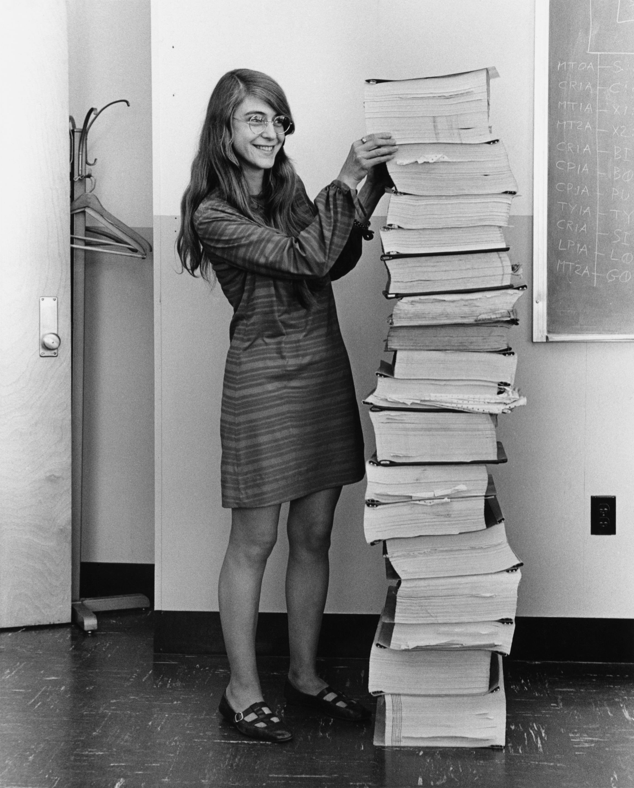

# margaret hamilton

_Margaret Hamilton — standing next to the stack of Apollo Guidance Computer source code she and her team wrote. She coined the term "software engineering" and her code prevented an abort during the Apollo 11 moon landing._

**Field:** Software Engineering

- **Lifespan:** b. 1936
- **Key contribution:** Apollo Guidance Computer software, coined "software engineering"
- **Impact:** Legitimized software as an engineering discipline, pioneered error detection and recovery, saved Apollo 11

## Biography

### Early Life & Education

Born Margaret Heafield in Paoli, Indiana in 1936. Studied mathematics at Earlham College (graduated 1958). Moved to Boston where her husband attended Harvard Law School. Started her career teaching high school math to support the family. Got into programming almost by accident — took a job at MIT to help pay the bills.

### Career

Joined MIT in 1960, working on software to predict weather patterns on an early computer (LGP-30). Self-taught programmer — there were no computer science degrees back then. In 1963, joined the Semi-Automatic Ground Environment (SAGE) Project at MIT's Lincoln Laboratory, developing software to search for enemy aircraft.

In 1965, joined the Apollo program at MIT's Instrumentation Laboratory (later renamed Draper Laboratory). At 29, became Director of the Software Engineering Division for the Apollo Guidance Computer (AGC) project. Led the team that wrote the on-board flight software for Apollo missions — the code that controlled navigation, guidance, and landing.

Her team developed pioneering concepts in software reliability: asynchronous software, priority scheduling, end-to-end testing, and error detection and recovery. She insisted on writing code that could detect errors and recover gracefully — a radical idea when computers were expected to work perfectly.

The most famous example: During the Apollo 11 moon landing, the computer was overloaded with tasks and started triggering alarms (1201 and 1202 errors). Hamilton's priority scheduling system ensured critical tasks kept running, allowing the landing to continue. Mission Control: "We're GO on that alarm." Armstrong landed with 15 seconds of fuel remaining. Hamilton's error recovery code had saved the mission.

After Apollo, founded Higher Order Software (1976) to develop Universal Systems Language (USL) — a formal systems modeling language. Later founded Hamilton Technologies (1986) to develop and commercialize USL-based tools.

### Later Life

Continues to advocate for rigorous software engineering practices. Received the Presidential Medal of Freedom in 2016 from President Obama. Still active in the field at 90 years old.

## Major Contributions

### 1. Apollo Guidance Computer Software (1965-1972)

- **Year:** 1965-1972
- **Context:** NASA needed reliable, real-time software for spacecraft navigation and landing
- **Technical Details:** Led team of 100+ programmers developing AGC software in assembly language. Pioneered: asynchronous software design, priority scheduling, end-to-end testing, man-in-the-loop simulation, comprehensive documentation. The code had to fit in 72KB of memory and execute reliably in radiation-filled space with no possibility of updates or patches.
- **Impact:** All Apollo missions used this software. Apollo 11 landing succeeded because of her error recovery code. Set the standard for mission-critical software development.

### 2. Coined "Software Engineering" (1968)

- **Year:** 1968
- **Context:** Programming was seen as a secondary skill, not "real" engineering
- **Technical Details:** Hamilton insisted on calling what she did "software engineering" to legitimize it as an engineering discipline equal to hardware engineering. Faced resistance — people said software wasn't real engineering. She proved them wrong.
- **Impact:** "Software engineering" is now a recognized discipline. Universities teach it. Professional licensing exists for it. All because Hamilton fought for the name.

### 3. Error Detection and Recovery Systems

- **Year:** 1960s
- **Context:** Computers were expected to work perfectly; errors meant failure
- **Technical Details:** Developed systems that could detect errors, prioritize critical tasks, and recover gracefully. The 1201/1202 alarms during Apollo 11 landing were the system working as designed — detecting overload, prioritizing landing tasks, and continuing safely.
- **Impact:** Foundation of modern fault-tolerant computing. Every mission-critical system today uses these concepts.

### 4. Universal Systems Language (USL)

- **Year:** 1976-present
- **Context:** Wanted a formal mathematical approach to systems design
- **Technical Details:** Developed USL — a formal systems modeling and specification language based on function theory. "001" tool suite for automated code generation and verification.
- **Impact:** Influenced formal methods and model-driven development approaches.

## Publications & Works

- Hamilton, M. & Hackler, W.R. "Universal Systems Language: Lessons Learned from Apollo" (2008)
- Numerous technical papers on software reliability and formal methods
- The original Apollo Guidance Computer code (now on GitHub!)

## Awards & Honors

| Year | Award                            |
| ---- | -------------------------------- |
| 1986 | Augusta Ada Lovelace Award       |
| 2003 | NASA Exceptional Space Act Award |
| 2016 | Presidential Medal of Freedom    |
| 2017 | Computer History Museum Fellow   |
| 2019 | Named one of BBC's 100 Women     |

## Quotes

> _"It quickly became clear that software was not like other engineering disciplines. So I began to use the term 'software engineering' to distinguish it. It was an ongoing joke for a long time. They liked to kid me about my radical ideas. But I think it's the most important thing I ever did."_

> _"Looking back, we were the luckiest people in the world. There was no choice but to be pioneers; no time to be beginners."_

> _"In those days, software was an afterthought. Hardware was the important thing. But I knew software was just as important — maybe more important."_

> _"We had to be 100% certain before we sent someone to the moon. Failure was not an option."_

## Influence & Legacy

### Direct Influence

Hamilton's Apollo software set the standard for mission-critical systems. Every spacecraft, aircraft, medical device, and safety-critical system today follows principles she pioneered: rigorous testing, error recovery, priority scheduling, comprehensive documentation.

### Indirect Influence

By coining and fighting for "software engineering," she elevated programming from a second-class skill to a legitimate engineering discipline. This opened doors for millions of future software engineers and established software as critical infrastructure.

### Modern Relevance

The iconic photo of Hamilton standing next to her stack of Apollo code has become a symbol of women in STEM and software engineering excellence. The code itself is on GitHub and still studied today. Her emphasis on reliability and testing is more relevant than ever as software controls everything from cars to medical devices to spacecraft.

## Related Figures

- **[Grace Hopper](../../foundational-cs/grace-hopper/)** — Pioneer of compilers, contemporary in early computing
- **[Ada Lovelace](../../pioneers/ada-lovelace/)** — First programmer; Hamilton received the Ada Lovelace Award
- **[Frances Allen](../frances-allen/)** — Compiler optimization pioneer, fellow woman in computing
- **[Barbara Liskov](../barbara-liskov/)** — Data abstraction pioneer, contemporary in software engineering
- **[Alan Turing](../../foundational-cs/alan-turing/)** — Theoretical foundations Hamilton built upon

## Resources

- [Margaret Hamilton's NASA Biography](https://www.nasa.gov/feature/margaret-hamilton-apollo-software-engineer-awarded-presidential-medal-of-freedom)
- [Apollo Guidance Computer Code on GitHub](https://github.com/chrislgarry/Apollo-11)
- [Presidential Medal of Freedom Ceremony (2016)](https://www.youtube.com/watch?v=DWcITjqZtpU)
- [Computer History Museum Interview](https://computerhistory.org/profile/margaret-hamilton/)
- [MIT News: "Apollo Code"](https://news.mit.edu/2016/scene-at-mit-margaret-hamilton-apollo-code-0817)
- [Margaret Hamilton: Apollo 11 Moon Landing Interview](https://www.youtube.com/watch?v=6bVRytYSTEk) — Interview about her work on the Apollo missions

## Timeline

| Year | Event                                                    |
| ---- | -------------------------------------------------------- |
| 1936 | Born in Paoli, Indiana                                   |
| 1958 | Graduated from Earlham College with mathematics degree   |
| 1960 | Joined MIT, began programming career                     |
| 1963 | Joined SAGE Project at MIT Lincoln Laboratory            |
| 1965 | Joined Apollo Guidance Computer project                  |
| 1968 | Coined term "software engineering"                       |
| 1969 | Apollo 11 lands on moon using her software               |
| 1969 | Became Director of Apollo Software Engineering Division  |
| 1972 | Final Apollo mission (Apollo 17)                         |
| 1976 | Founded Higher Order Software                            |
| 1986 | Founded Hamilton Technologies                            |
| 2003 | Received NASA Exceptional Space Act Award ($37,200)      |
| 2016 | Awarded Presidential Medal of Freedom by President Obama |
| 2017 | Named Computer History Museum Fellow                     |

## References

1. Hamilton, M. & Hackler, W.R. (2008). "Universal Systems Language: Lessons Learned from Apollo."
2. NASA. (2016). "Margaret Hamilton: Apollo Software Engineer."
3. Computer History Museum Fellow citation (2017).
4. Presidential Medal of Freedom citation (2016).
5. Mindell, David A. "Digital Apollo: Human and Machine in Spaceflight" (2008).

---

**Last Updated:** 2026-03-11
